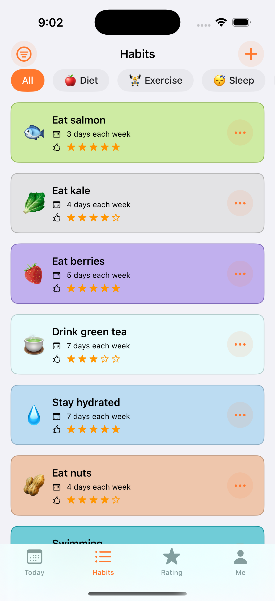

# Longevity Master 🏃‍♂️

[](https://swift.org)
[](https://developer.apple.com/ios/)
[](https://developer.apple.com/xcode/swiftui/)
[](https://creativecommons.org/licenses/by-nc/4.0/)

A modern habit-tracking iOS app built with SwiftUI and GRDB, designed to help users build and maintain habits that promote long-term health and longevity. Longevity Master focuses on evidence-based habits that contribute to healthy aging and overall well-being.

## 📱 Download on the App Store

<div align="center">
  <a href="https://apps.apple.com/us/app/longevity-master-habits/id6747810020">
    
  </a>
</div>

**Now available on the App Store!** 🎉

Build powerful daily habits to extend your lifespan. Longevity Master helps you live longer and feel better with science-based routines for health and wellness.

## 📱 Screenshots

<div align="center">
  
  
  
  

</div>

*The app features a clean, modern interface with habit cards, tracking views, and intuitive navigation designed to help users build lasting health habits.*

## ✨ Features

### 🎯 Core Functionality
- **Habit Tracking**: Create, edit, and track daily habits with customizable frequencies
- **Anti-Aging Rating System**: Each habit includes a 1-5 star rating based on scientific evidence for longevity benefits
- **Smart Categories**: Organized into 5 key areas (Diet, Exercise, Sleep, Preventive Health, Mental Health)

### 🏆 Achievement System
- **24 Achievements**: Streak milestones, check-in goals, perfect weeks/months, category mastery, time-based challenges
- **Progress Tracking**: Visual progress bars and celebration animations
- **Social Sharing**: Share achievements with friends

### 🔔 Smart Reminders
- **Customizable Notifications**: Set personalized reminder times for each habit
- **Habit-Specific Alerts**: Link reminders directly to individual habits
- **Easy Management**: Simple setup and notification preferences

### ⭐ Longevity Rating System
- **12-Level Rating**: From Beginner (F) to Legend (SSS) based on overall health habits
- **Multi-Dimensional Scoring**: Active habits, anti-aging ratings, achievements, check-ins, and streaks
- **Progress Analytics**: Detailed breakdowns and improvement tips

### 🎨 User Experience
- **Modern SwiftUI Interface**: Clean, intuitive design following iOS guidelines
- **Flexible Scheduling**: Support for various frequency patterns (weekly, monthly, custom)
- **Theme Customization**: Multiple color themes and personalization options
- **Haptic Feedback & Sound Effects**: Enhanced user interaction

### 💾 Data Management
- **GRDB Database**: Robust local data storage with SQLite
- **Calendar Integration**: Monthly and yearly habit tracking views
- **Streak Calculation**: Automatic streak tracking with flexible settings
- **Data Export**: Built-in data export capabilities

### 📊 Analytics & Insights
- **Habit Statistics**: Detailed analytics for each habit
- **Progress Visualization**: Calendar views showing completion patterns
- **Category Analysis**: Performance breakdown by habit category
- **Achievement Progress**: Visual progress tracking for all achievements

### 🔧 Advanced Features
- **Habit Archiving**: Archive habits without losing data
- **Icon Customization**: Choose from extensive emoji icon library
- **Multi-language Support**: English and Simplified Chinese localization

## 🏗️ Architecture

### Tech Stack
- **SwiftUI 5.0**: Modern declarative UI framework
- **GRDB**: SQLite database with Swift integration
- **Observation Framework**: Reactive data binding
- **SwiftUINavigation**: Type-safe navigation handling

### Project Structure
```
LongevityMaster/
├── App/
│   └── LongevityMasterApp.swift          # App entry point
├── Components/
│   ├── Common/                           # Reusable UI components
│   │   ├── HabitCardView.swift
│   │   └── HabitItemView.swift
│   ├── Habits/                           # Habit management views
│   │   ├── HabitForm.swift
│   │   ├── HabitIconEdit.swift
│   │   ├── HabitsGallery.swift
│   │   └── HabitsList.swift
│   ├── Me/                               # User profile and settings
│   │   ├── AppItem.swift
│   │   ├── MeFeature.swift
│   │   └── MoreAppsView.swift
│   └── Today/                            # Daily habit tracking
│       ├── TodayView.swift
│       └── TodayViewModel.swift
├── Model/                                # Data models
│   ├── CheckIn.swift
│   ├── Habit.swift
│   └── TodayHabit.swift
├── Service/                              # Business logic and data services
│   ├── HabitIconColorDataSource.swift
│   ├── HabitIconDataSource.swift
│   └── HabitsDataStore.swift
└── Utilities/                            # Helper functions and extensions
    ├── Constants.swift
    ├── Extension/
    │   ├── Color+Extensions.swift
    │   ├── Date+Extension.swift
    │   └── Habit+Extension.swift
    ├── HashableObject.swift
    └── Schema.swift
```

## 🚀 Getting Started

### For Users
Download Longevity Master from the [App Store](https://apps.apple.com/us/app/longevity-master-habits/id6747810020) and start building healthy habits today!

### For Developers

#### Prerequisites
- Xcode 15.0 or later
- iOS 17.0+ deployment target
- macOS 14.0+ (for development)

#### Installation

1. **Clone the repository**
   ```bash
   git clone https://github.com/banghuazhao/longevity-master.git
   cd longevity-master
   ```

2. **Open in Xcode**
   ```bash
   open LongevityMaster.xcodeproj
   ```

3. **Build and Run**
   - Select your target device or simulator
   - Press `Cmd + R` to build and run the app

#### Development Setup

The project uses several key dependencies managed through Swift Package Manager:

- **GRDB**: Database layer
- **SwiftUINavigation**: Navigation handling
- **Observation**: Reactive programming

## 🔧 Configuration

### Database Setup
The app uses GRDB for local data storage. The database is automatically initialized when the app launches.

### Customization
- **Habit Categories**: Easily extend the `HabitCategory` enum to add new categories
- **Frequency Types**: Modify `HabitFrequency` to support different scheduling patterns
- **UI Themes**: Customize colors and styling in the `Constants.swift` file

## 🤝 Contributing

We welcome contributions! Please follow these guidelines:

### Development Process
1. Fork the repository
2. Create a feature branch (`git checkout -b feature/amazing-feature`)
3. Commit your changes (`git commit -m 'Add amazing feature'`)
4. Push to the branch (`git push origin feature/amazing-feature`)
5. Open a Pull Request

### Code Style
- Follow Swift style guidelines
- Use meaningful variable and function names
- Add comments for complex logic
- Ensure all code compiles without warnings

### Testing
- Test on both iPhone and iPad simulators
- Verify functionality across different iOS versions
- Test edge cases and error scenarios

## 📄 License

This project is licensed under the **Creative Commons Attribution-NonCommercial 4.0 International License** ([CC BY-NC 4.0](https://creativecommons.org/licenses/by-nc/4.0/)).

This means you can:
- ✅ Use, share, and modify the code for non-commercial purposes
- ✅ Distribute the code with proper attribution
- ❌ Use the code for commercial purposes without permission

## 🆘 Support

- **App Store**: [Longevity Master on the App Store](https://apps.apple.com/us/app/longevity-master-habits/id6747810020)
- **Issues**: [GitHub Issues](https://github.com/banghuazhao/longevity-master/issues)
- **Discussions**: [GitHub Discussions](https://github.com/banghuazhao/longevity-master/discussions)
- **Email**: Open an issue for direct contact

## 🗺️ Roadmap

### Long-term Goals
- [ ] AI powered scientific habit recommendations
- [ ] Integration with HealthKit
- [ ] Data export and backup
- [ ] Community features

## 🙏 Acknowledgments

- Built with ❤️ using SwiftUI and modern iOS development practices
- Inspired by scientific research on longevity and healthy aging
- Thanks to the open-source community for amazing tools and libraries

---

**Made with ❤️ by [Banghua Zhao](https://github.com/banghuazhao)**

*Empowering users to build habits that last a lifetime* 🌟
